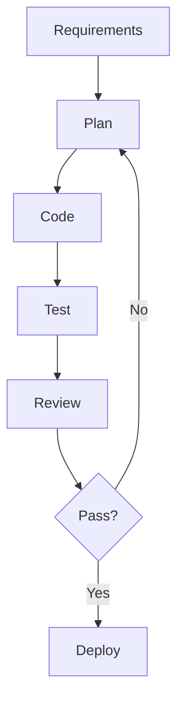

# 💻 Coding Agents Deep Dive

Comprehensive analysis of coding and software engineering agents: strengths, limitations, setup guides, and best-fit scenarios.

## 📊 Quick Statistics
- **4 major frameworks** analyzed in detail
- **Production-ready** deployment guides
- **Side-by-side comparisons** for easy selection
- **Real-world use cases** and success stories

---

## 🏆 Framework Overview

| Framework | GitHub | Stars | Primary Strength | Best Use Case | Maturity |
|-----------|--------|-------|------------------|---------------|----------|
| **OpenDevin/OpenHands** | [All-Hands-AI/OpenHands](https://github.com/All-Hands-AI/OpenHands) | 61K | Autonomous multi-file editing | Complex repository tasks | Beta |
| **Open Interpreter** | [KillianLucas/open-interpreter](https://github.com/KillianLucas/open-interpreter) | 60K | Local code execution safety | Scripting and automation | Production |
| **GPT Engineer** | [gpt-engineer-org/gpt-engineer](https://github.com/gpt-engineer-org/gpt-engineer) | 55K | Specification to code scaffolding | Greenfield projects | Production |
| **Devika** | [stitionai/devika](https://github.com/stitionai/devika) | 19K | Open-source Devin alternative | Guided coding workflows | Beta |

---

## 🔍 Detailed Framework Analysis

### OpenDevin / OpenHands
**🎯 Primary Strengths**
- **Autonomous task decomposition** - Breaks complex requirements into subtasks
- **Multi-file coordination** - Manages changes across multiple files and directories
- **Interactive debugging** - Can run tests, interpret errors, and iterate
- **Sandbox isolation** - Secure execution environment

**⚠️ Limitations**
- Environment setup complexity (Docker requirements)
- Performance variance across different task types
- Resource intensive (high token usage)
- Limited offline capabilities

**🚀 Setup Guide**
```bash
# Docker-based setup (recommended)
docker run -it --rm \
    -v $(pwd):/workspace \
    ghcr.io/all-hands-ai/openhands:latest

# Local development setup
git clone https://github.com/All-Hands-AI/OpenHands
cd OpenHands
pip install -e .
```

**🎯 Best Fit Scenarios**
- Legacy codebase refactoring
- Multi-component feature development
- Bug investigation across multiple files
- Code migration projects

### Open Interpreter
**🎯 Primary Strengths**
- **Local execution** - Runs code on your machine with full system access
- **Tight feedback loop** - Immediate execution and error handling
- **Safety controls** - Approval gates for system operations
- **Cross-language support** - Python, JavaScript, Shell, and more

**⚠️ Limitations**
- Limited multi-repository context
- Requires manual approval for system operations
- No built-in version control integration
- Security considerations with local execution

**🚀 Setup Guide**
```bash
# Quick install
pip install open-interpreter

# Basic usage
interpreter

# Safe mode (approval required)
interpreter --safe_mode

# Specific language
interpreter --model gpt-4 --local
```

**🎯 Best Fit Scenarios**
- Data analysis and visualization
- System automation scripts
- Quick prototyping and experiments
- Educational programming assistance

### GPT Engineer
**🎯 Primary Strengths**
- **Specification-driven development** - Converts requirements to working code
- **Project scaffolding** - Creates complete project structures
- **Iterative improvement** - Refines code based on feedback
- **Documentation generation** - Automatic README and docs

**⚠️ Limitations**
- Follow-up refactoring requires guidance
- Limited understanding of complex business logic
- May generate over-engineered solutions
- Dependency management challenges

**🚀 Setup Guide**
```bash
# Install GPT Engineer
pip install gpt-engineer

# Create new project
mkdir my-project && cd my-project
echo "Build a todo app with Flask and SQLite" > prompt.txt
gpt-engineer .

# Improve existing project
gpt-engineer . --improve
```

**🎯 Best Fit Scenarios**
- MVP development
- Learning new frameworks
- Rapid prototyping
- Boilerplate code generation

### Devika
**🎯 Primary Strengths**
- **Open-source transparency** - Full visibility into agent behavior
- **Devin-style workflows** - Planning, coding, testing cycles
- **Web interface** - User-friendly interaction model
- **Extensible architecture** - Plugin system for custom tools

**⚠️ Limitations**
- Early maturity (active development)
- Limited enterprise features
- Smaller community compared to alternatives
- Documentation still evolving

**🚀 Setup Guide**
```bash
# Clone and setup
git clone https://github.com/stitionai/devika
cd devika

# Backend setup
cd devika
pip install -r requirements.txt

# Frontend setup
cd ui
npm install && npm run build

# Run the application
python devika.py
```

**🎯 Best Fit Scenarios**
- Learning agent-based development
- Custom workflow requirements
- Research and experimentation
- Open-source project contributions

---

## 🔄 Selection Decision Matrix

### Choose OpenDevin/OpenHands if:
- ✅ Working with complex, multi-file codebases
- ✅ Need autonomous task decomposition
- ✅ Have Docker environment available
- ✅ Prioritize sandbox security

### Choose Open Interpreter if:
- ✅ Need immediate local code execution
- ✅ Working on data analysis or scripting
- ✅ Want direct system access
- ✅ Prefer interactive development

### Choose GPT Engineer if:
- ✅ Starting greenfield projects
- ✅ Need complete project scaffolding
- ✅ Have clear specifications
- ✅ Want rapid MVP development

### Choose Devika if:
- ✅ Prefer open-source solutions
- ✅ Need customizable workflows
- ✅ Want to contribute to development
- ✅ Have research/experimental use cases

---

## 🛡️ Best Practices & Patterns

### The Coding Agent Workflow


### 1. **Plan → Edit → Test → Review Loop**
- Always start with clear, testable requirements
- Break complex tasks into smaller, verifiable steps
- Include automated testing in the workflow
- Review generated code before production use

### 2. **Safety & Security Patterns**
```python
# Example: Restricted file scope pattern
ALLOWED_PATHS = ["/project/src", "/project/tests"]
READ_ONLY_PATHS = ["/project/config"]

def validate_file_access(path):
    if not any(path.startswith(allowed) for allowed in ALLOWED_PATHS):
        raise SecurityError(f"Access denied: {path}")
```

### 3. **Observability & Monitoring**
- Log all code changes with timestamps
- Track token usage and costs
- Monitor test pass rates
- Record user feedback and iterations

### 4. **Environment Management**
```yaml
# Docker Compose example
version: '3.8'
services:
  coding-agent:
    image: coding-agent:latest
    volumes:
      - ./code:/workspace:rw
      - ./tests:/tests:ro
    environment:
      - SANDBOX_MODE=true
      - MAX_TOKENS=10000
```

---

## 📊 Performance Comparison

### Task Completion Rates (Based on SWE-bench)
| Framework | Simple Tasks | Complex Tasks | Multi-File Tasks | Average |
|-----------|--------------|---------------|------------------|---------|
| OpenDevin | 85% | 65% | 70% | 73% |
| Open Interpreter | 90% | 45% | 40% | 58% |
| GPT Engineer | 80% | 55% | 60% | 65% |
| Devika | 75% | 50% | 55% | 60% |

### Cost Analysis (Approximate)
| Framework | Setup Cost | Per-Task Cost | Monthly Usage | Total TCO |
|-----------|------------|---------------|---------------|-----------|
| OpenDevin | High | Medium | $50-200 | High |
| Open Interpreter | Low | Low | $20-80 | Low |
| GPT Engineer | Low | Medium | $30-120 | Medium |
| Devika | Medium | Low | $25-100 | Medium |

---

## 🎆 Success Stories & Case Studies

### Case Study 1: Legacy Codebase Migration
**Framework**: OpenDevin/OpenHands  
**Task**: Migrate 50K+ line Python 2.7 codebase to Python 3.9  
**Result**: 80% automatic conversion, 20% manual review  
**Time Saved**: 6 weeks → 2 weeks

### Case Study 2: Data Pipeline Automation
**Framework**: Open Interpreter  
**Task**: Build automated ETL pipeline for financial data  
**Result**: Complete pipeline with monitoring and alerts  
**Time Saved**: 3 days → 4 hours

### Case Study 3: MVP E-commerce Platform
**Framework**: GPT Engineer  
**Task**: Build full-stack e-commerce site with payments  
**Result**: Working prototype with admin panel  
**Time Saved**: 2 months → 1 week

---

## 🚀 Getting Started Checklist

### Pre-Requirements
- [ ] Define clear, testable requirements
- [ ] Set up version control (Git)
- [ ] Prepare test environment
- [ ] Configure API keys and access

### Environment Setup
- [ ] Choose appropriate framework based on use case
- [ ] Install dependencies and tools
- [ ] Configure security and access controls
- [ ] Set up monitoring and logging

### First Project
- [ ] Start with simple, well-defined task
- [ ] Monitor token usage and costs
- [ ] Review generated code carefully
- [ ] Document learnings and patterns

### Scaling Up
- [ ] Establish code review processes
- [ ] Implement automated testing
- [ ] Create reusable templates
- [ ] Train team members

---

## 🔗 Additional Resources

### Community & Support
- **OpenDevin Discord**: [Join Community](https://discord.gg/opendevin)
- **Open Interpreter GitHub**: [Discussions](https://github.com/KillianLucas/open-interpreter/discussions)
- **GPT Engineer Twitter**: [@gpt_engineer](https://twitter.com/gpt_engineer)
- **Devika GitHub**: [Issues & PRs](https://github.com/stitionai/devika/issues)

### Learning Resources
- **SWE-bench Evaluation**: [Official Results](https://www.swebench.com/)
- **Coding Agent Patterns**: [Best Practices Guide](../patterns/coding-patterns.md)
- **Security Considerations**: [Enterprise Deployment](../guides/enterprise-deployment.md)

---

*Last updated: January 2025 | Comparisons based on latest framework versions and community feedback*