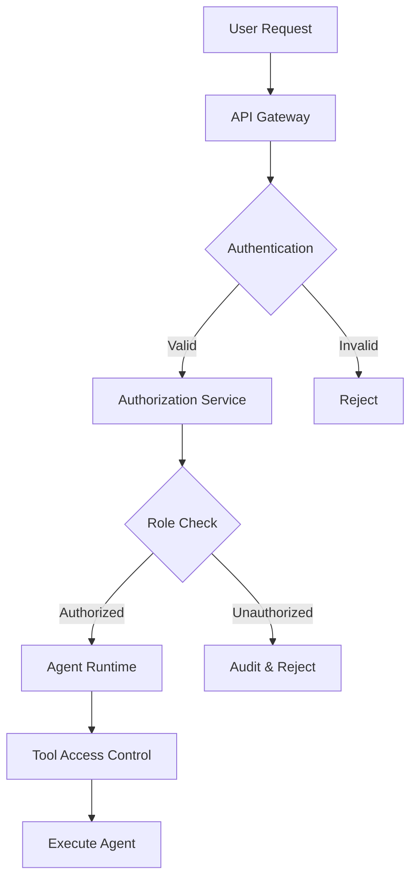

# 🛡️ Enterprise Agent Deployment Playbook

Comprehensive guide for deploying AI agents in production environments with security, governance, monitoring, and scaling considerations.

## 🎯 Executive Summary

This playbook provides enterprise-grade patterns for:
- **Security & Governance** - AuthN/Z, secret management, compliance
- **Cost & Reliability** - Optimization, monitoring, SLAs
- **Deployment Models** - Local, cloud, hybrid architectures
- **Operational Excellence** - Monitoring, maintenance, incident response

---

## 🛡️ Security & Governance

### Authentication & Authorization

**Multi-Layer Security Model**


**Implementation Example**
```python
from typing import List, Dict, Optional
import jwt
import time

class EnterpriseAuthManager:
    def __init__(self, secret_key: str, token_ttl: int = 3600):
        self.secret_key = secret_key
        self.token_ttl = token_ttl
        self.role_permissions = {
            "admin": ["agent:create", "agent:delete", "agent:execute", "tool:all"],
            "developer": ["agent:execute", "tool:read", "tool:write"],
            "analyst": ["agent:execute", "tool:read"],
            "viewer": ["tool:read"]
        }
    
    def authenticate_user(self, token: str) -> Optional[Dict]:
        try:
            payload = jwt.decode(token, self.secret_key, algorithms=["HS256"])
            if payload["exp"] < time.time():
                return None
            return payload
        except jwt.InvalidTokenError:
            return None
    
    def authorize_action(self, user_role: str, action: str) -> bool:
        permissions = self.role_permissions.get(user_role, [])
        return action in permissions or "tool:all" in permissions
    
    def create_scoped_token(self, user_id: str, role: str, scopes: List[str]) -> str:
        payload = {
            "user_id": user_id,
            "role": role,
            "scopes": scopes,
            "exp": time.time() + self.token_ttl,
            "iat": time.time()
        }
        return jwt.encode(payload, self.secret_key, algorithm="HS256")

# Usage example
auth_manager = EnterpriseAuthManager("your-secret-key")

# Create scoped token
token = auth_manager.create_scoped_token(
    user_id="analyst@company.com",
    role="analyst", 
    scopes=["financial_data", "market_research"]
)

# Validate and authorize
user = auth_manager.authenticate_user(token)
if user and auth_manager.authorize_action(user["role"], "agent:execute"):
    # Proceed with agent execution
    pass
```

### Secret Management

**Centralized Secret Management**
```python
import hvac  # HashiCorp Vault client
import boto3  # AWS Secrets Manager
from azure.keyvault.secrets import SecretClient
from typing import Protocol

class SecretProvider(Protocol):
    def get_secret(self, secret_name: str) -> str: ...
    def rotate_secret(self, secret_name: str) -> str: ...

class VaultSecretProvider:
    def __init__(self, vault_url: str, token: str):
        self.client = hvac.Client(url=vault_url, token=token)
    
    def get_secret(self, secret_path: str) -> str:
        response = self.client.secrets.kv.v2.read_secret_version(
            path=secret_path
        )
        return response['data']['data']['value']
    
    def rotate_secret(self, secret_path: str) -> str:
        # Implement secret rotation logic
        new_secret = self.generate_new_secret()
        self.client.secrets.kv.v2.create_or_update_secret(
            path=secret_path,
            secret={"value": new_secret}
        )
        return new_secret

class AWSSecretsProvider:
    def __init__(self, region: str):
        self.client = boto3.client('secretsmanager', region_name=region)
    
    def get_secret(self, secret_name: str) -> str:
        response = self.client.get_secret_value(SecretId=secret_name)
        return response['SecretString']
    
    def rotate_secret(self, secret_name: str) -> str:
        self.client.rotate_secret(SecretId=secret_name)
        # Return new secret after rotation completes
        return self.get_secret(secret_name)

# Agent configuration with secret injection
class SecureAgentConfig:
    def __init__(self, secret_provider: SecretProvider):
        self.secret_provider = secret_provider
    
    def get_agent_config(self, agent_id: str) -> Dict:
        return {
            "openai_api_key": self.secret_provider.get_secret(f"agents/{agent_id}/openai_key"),
            "database_url": self.secret_provider.get_secret(f"agents/{agent_id}/db_url"),
            "external_api_key": self.secret_provider.get_secret(f"agents/{agent_id}/external_api")
        }
```

### Compliance & Audit Trails

**Comprehensive Audit Logging**
```python
import json
import time
from dataclasses import dataclass, asdict
from typing import Any, Dict, Optional
from enum import Enum

class AuditEventType(Enum):
    AGENT_CREATED = "agent.created"
    AGENT_EXECUTED = "agent.executed"
    TOOL_ACCESSED = "tool.accessed"
    SECRET_ACCESSED = "secret.accessed"
    PERMISSION_DENIED = "permission.denied"
    ERROR_OCCURRED = "error.occurred"

@dataclass
class AuditEvent:
    timestamp: float
    event_type: AuditEventType
    user_id: str
    agent_id: str
    resource: str
    action: str
    result: str
    metadata: Dict[str, Any]
    ip_address: Optional[str] = None
    user_agent: Optional[str] = None

class ComplianceAuditor:
    def __init__(self, storage_backend: str = "elasticsearch"):
        self.storage_backend = storage_backend
        self.sensitive_fields = {"api_key", "password", "token", "secret"}
    
    def log_event(self, event: AuditEvent):
        # Redact sensitive information
        clean_metadata = self._redact_sensitive_data(event.metadata)
        event.metadata = clean_metadata
        
        # Store audit event
        audit_record = {
            **asdict(event),
            "event_type": event.event_type.value,
            "compliance_version": "SOC2-Type2",
            "retention_date": time.time() + (365 * 24 * 3600)  # 1 year
        }
        
        self._store_audit_record(audit_record)
    
    def _redact_sensitive_data(self, data: Dict[str, Any]) -> Dict[str, Any]:
        cleaned = {}
        for key, value in data.items():
            if any(sensitive in key.lower() for sensitive in self.sensitive_fields):
                cleaned[key] = "[REDACTED]"
            elif isinstance(value, dict):
                cleaned[key] = self._redact_sensitive_data(value)
            else:
                cleaned[key] = value
        return cleaned
    
    def _store_audit_record(self, record: Dict[str, Any]):
        # Implementation depends on storage backend
        if self.storage_backend == "elasticsearch":
            # Store in Elasticsearch for searchability
            pass
        elif self.storage_backend == "s3":
            # Store in S3 for cost-effective long-term retention
            pass
        
        # Always log to local file for immediate access
        with open("audit.jsonl", "a") as f:
            f.write(json.dumps(record) + "\n")

# Usage in agent execution
auditor = ComplianceAuditor()

def execute_agent_with_audit(user_id: str, agent_id: str, task: str):
    start_time = time.time()
    
    try:
        # Log execution start
        auditor.log_event(AuditEvent(
            timestamp=start_time,
            event_type=AuditEventType.AGENT_EXECUTED,
            user_id=user_id,
            agent_id=agent_id,
            resource=f"agent:{agent_id}",
            action="execute",
            result="started",
            metadata={"task": task, "execution_id": f"exec_{int(start_time)}"}
        ))
        
        # Execute agent (placeholder)
        result = "Agent execution completed"
        
        # Log successful completion
        auditor.log_event(AuditEvent(
            timestamp=time.time(),
            event_type=AuditEventType.AGENT_EXECUTED,
            user_id=user_id,
            agent_id=agent_id,
            resource=f"agent:{agent_id}",
            action="execute",
            result="success",
            metadata={
                "task": task,
                "duration": time.time() - start_time,
                "tokens_used": 1500,
                "tools_accessed": ["web_search", "calculator"]
            }
        ))
        
        return result
    
    except Exception as e:
        # Log error
        auditor.log_event(AuditEvent(
            timestamp=time.time(),
            event_type=AuditEventType.ERROR_OCCURRED,
            user_id=user_id,
            agent_id=agent_id,
            resource=f"agent:{agent_id}",
            action="execute",
            result="error",
            metadata={
                "error_type": type(e).__name__,
                "error_message": str(e),
                "duration": time.time() - start_time
            }
        ))
        raise
```

---

## 📊 Cost & Reliability Optimization

### Intelligent Caching Strategy

**Multi-Level Caching Architecture**
```python
import hashlib
import json
import redis
import time
from typing import Any, Dict, Optional, Tuple
from dataclasses import dataclass

@dataclass
class CacheEntry:
    value: Any
    timestamp: float
    ttl: int
    hit_count: int = 0
    cost_saved: float = 0.0

class IntelligentCache:
    def __init__(self, redis_client: redis.Redis):
        self.redis = redis_client
        self.local_cache = {}  # L1 cache
        self.cache_stats = {"hits": 0, "misses": 0, "cost_saved": 0.0}
    
    def _generate_key(self, prompt: str, model: str, temperature: float) -> str:
        content = f"{prompt}:{model}:{temperature}"
        return hashlib.sha256(content.encode()).hexdigest()[:16]
    
    def get(self, prompt: str, model: str, temperature: float = 0.7) -> Optional[str]:
        cache_key = self._generate_key(prompt, model, temperature)
        
        # L1 cache check (fastest)
        if cache_key in self.local_cache:
            entry = self.local_cache[cache_key]
            if time.time() - entry.timestamp < entry.ttl:
                entry.hit_count += 1
                self.cache_stats["hits"] += 1
                return entry.value
            else:
                del self.local_cache[cache_key]
        
        # L2 cache check (Redis)
        try:
            cached_data = self.redis.get(f"agent_cache:{cache_key}")
            if cached_data:
                entry_data = json.loads(cached_data)
                if time.time() - entry_data["timestamp"] < entry_data["ttl"]:
                    # Promote to L1 cache
                    self.local_cache[cache_key] = CacheEntry(
                        value=entry_data["value"],
                        timestamp=entry_data["timestamp"],
                        ttl=entry_data["ttl"],
                        hit_count=entry_data["hit_count"] + 1
                    )
                    self.cache_stats["hits"] += 1
                    return entry_data["value"]
        except Exception as e:
            print(f"Redis cache error: {e}")
        
        self.cache_stats["misses"] += 1
        return None
    
    def set(self, prompt: str, model: str, response: str, 
            temperature: float = 0.7, ttl: int = 3600, cost: float = 0.0):
        cache_key = self._generate_key(prompt, model, temperature)
        
        entry = CacheEntry(
            value=response,
            timestamp=time.time(),
            ttl=ttl,
            cost_saved=cost
        )
        
        # Store in L1 cache
        self.local_cache[cache_key] = entry
        
        # Store in L2 cache (Redis) with expiration
        try:
            entry_data = {
                "value": response,
                "timestamp": entry.timestamp,
                "ttl": ttl,
                "hit_count": 0,
                "cost_saved": cost
            }
            self.redis.setex(
                f"agent_cache:{cache_key}",
                ttl,
                json.dumps(entry_data)
            )
        except Exception as e:
            print(f"Redis cache set error: {e}")
    
    def get_stats(self) -> Dict[str, Any]:
        total_requests = self.cache_stats["hits"] + self.cache_stats["misses"]
        hit_rate = (self.cache_stats["hits"] / total_requests * 100) if total_requests > 0 else 0
        
        return {
            "hit_rate": f"{hit_rate:.2f}%",
            "total_hits": self.cache_stats["hits"],
            "total_misses": self.cache_stats["misses"],
            "cost_saved": f"${self.cache_stats['cost_saved']:.2f}",
            "cache_size_l1": len(self.local_cache)
        }
```

### Circuit Breaker Pattern

**Resilient External Service Integration**
```python
import time
import asyncio
from enum import Enum
from typing import Callable, Any, Optional
from dataclasses import dataclass

class CircuitState(Enum):
    CLOSED = "closed"      # Normal operation
    OPEN = "open"          # Failing, reject requests
    HALF_OPEN = "half_open" # Testing if service recovered

@dataclass
class CircuitBreakerConfig:
    failure_threshold: int = 5
    timeout: int = 60  # seconds
    recovery_timeout: int = 30
    expected_exception: type = Exception

class CircuitBreaker:
    def __init__(self, config: CircuitBreakerConfig):
        self.config = config
        self.state = CircuitState.CLOSED
        self.failure_count = 0
        self.last_failure_time = None
        self.success_count = 0
    
    async def call(self, func: Callable, *args, **kwargs) -> Any:
        if self.state == CircuitState.OPEN:
            if self._should_attempt_reset():
                self.state = CircuitState.HALF_OPEN
                self.success_count = 0
            else:
                raise Exception(f"Circuit breaker OPEN. Service unavailable.")
        
        try:
            result = await self._execute_with_timeout(func, *args, **kwargs)
            self._on_success()
            return result
        except self.config.expected_exception as e:
            self._on_failure()
            raise e
    
    async def _execute_with_timeout(self, func: Callable, *args, **kwargs) -> Any:
        try:
            return await asyncio.wait_for(
                func(*args, **kwargs),
                timeout=self.config.timeout
            )
        except asyncio.TimeoutError:
            raise Exception(f"Function call timed out after {self.config.timeout}s")
    
    def _on_success(self):
        if self.state == CircuitState.HALF_OPEN:
            self.success_count += 1
            if self.success_count >= 3:  # Require multiple successes
                self.state = CircuitState.CLOSED
                self.failure_count = 0
        else:
            self.failure_count = 0
    
    def _on_failure(self):
        self.failure_count += 1
        self.last_failure_time = time.time()
        
        if self.failure_count >= self.config.failure_threshold:
            self.state = CircuitState.OPEN
    
    def _should_attempt_reset(self) -> bool:
        if self.last_failure_time is None:
            return False
        return (time.time() - self.last_failure_time) >= self.config.recovery_timeout
    
    def get_state(self) -> Dict[str, Any]:
        return {
            "state": self.state.value,
            "failure_count": self.failure_count,
            "last_failure": self.last_failure_time,
            "success_count": self.success_count if self.state == CircuitState.HALF_OPEN else None
        }

# Usage with agent tools
class ResilientToolManager:
    def __init__(self):
        self.circuit_breakers = {}
    
    def get_circuit_breaker(self, service_name: str) -> CircuitBreaker:
        if service_name not in self.circuit_breakers:
            config = CircuitBreakerConfig(
                failure_threshold=3,
                timeout=30,
                recovery_timeout=60
            )
            self.circuit_breakers[service_name] = CircuitBreaker(config)
        return self.circuit_breakers[service_name]
    
    async def call_external_api(self, service_name: str, api_call: Callable) -> Any:
        circuit_breaker = self.get_circuit_breaker(service_name)
        return await circuit_breaker.call(api_call)

# Example usage
tool_manager = ResilientToolManager()

async def unreliable_web_search(query: str) -> str:
    # Simulate external API that might fail
    import random
    if random.random() < 0.3:  # 30% failure rate
        raise Exception("External API failed")
    return f"Search results for: {query}"

# Agent tool with circuit breaker
async def search_with_resilience(query: str) -> str:
    try:
        return await tool_manager.call_external_api(
            "web_search", 
            lambda: unreliable_web_search(query)
        )
    except Exception as e:
        # Fallback strategy
        return f"Search temporarily unavailable. Cached result for: {query}"
```

### Cost Monitoring & Budgets

**Real-time Cost Tracking**
```python
from typing import Dict, List, Optional
from dataclasses import dataclass
from datetime import datetime, timedelta
import json

@dataclass
class CostEvent:
    timestamp: datetime
    user_id: str
    agent_id: str
    model: str
    tokens_used: int
    cost: float
    task_type: str

class CostManager:
    def __init__(self):
        self.cost_events: List[CostEvent] = []
        self.budgets = {}  # user_id -> budget info
        self.pricing = {
            "gpt-4": {"input": 0.03, "output": 0.06},  # per 1K tokens
            "gpt-3.5-turbo": {"input": 0.0015, "output": 0.002},
            "claude-3-sonnet": {"input": 0.003, "output": 0.015}
        }
    
    def set_budget(self, user_id: str, monthly_limit: float, 
                   daily_limit: Optional[float] = None):
        self.budgets[user_id] = {
            "monthly_limit": monthly_limit,
            "daily_limit": daily_limit or monthly_limit / 30,
            "alerts_sent": {"80_percent": False, "90_percent": False}
        }
    
    def calculate_cost(self, model: str, input_tokens: int, output_tokens: int) -> float:
        if model not in self.pricing:
            return 0.0
        
        pricing = self.pricing[model]
        input_cost = (input_tokens / 1000) * pricing["input"]
        output_cost = (output_tokens / 1000) * pricing["output"]
        return input_cost + output_cost
    
    def record_usage(self, user_id: str, agent_id: str, model: str, 
                    input_tokens: int, output_tokens: int, task_type: str) -> Dict[str, Any]:
        cost = self.calculate_cost(model, input_tokens, output_tokens)
        
        event = CostEvent(
            timestamp=datetime.now(),
            user_id=user_id,
            agent_id=agent_id,
            model=model,
            tokens_used=input_tokens + output_tokens,
            cost=cost,
            task_type=task_type
        )
        
        self.cost_events.append(event)
        
        # Check budget limits
        budget_status = self._check_budget_limits(user_id)
        
        return {
            "cost": cost,
            "total_tokens": input_tokens + output_tokens,
            "budget_status": budget_status,
            "usage_allowed": budget_status["can_continue"]
        }
    
    def _check_budget_limits(self, user_id: str) -> Dict[str, Any]:
        if user_id not in self.budgets:
            return {"can_continue": True, "message": "No budget set"}
        
        budget = self.budgets[user_id]
        now = datetime.now()
        
        # Calculate current month and day usage
        month_start = now.replace(day=1, hour=0, minute=0, second=0, microsecond=0)
        day_start = now.replace(hour=0, minute=0, second=0, microsecond=0)
        
        monthly_usage = sum(
            event.cost for event in self.cost_events
            if event.user_id == user_id and event.timestamp >= month_start
        )
        
        daily_usage = sum(
            event.cost for event in self.cost_events
            if event.user_id == user_id and event.timestamp >= day_start
        )
        
        monthly_percent = (monthly_usage / budget["monthly_limit"]) * 100
        daily_percent = (daily_usage / budget["daily_limit"]) * 100
        
        # Send alerts at 80% and 90% thresholds
        if monthly_percent >= 90 and not budget["alerts_sent"]["90_percent"]:
            self._send_budget_alert(user_id, "monthly", 90, monthly_usage, budget["monthly_limit"])
            budget["alerts_sent"]["90_percent"] = True
        elif monthly_percent >= 80 and not budget["alerts_sent"]["80_percent"]:
            self._send_budget_alert(user_id, "monthly", 80, monthly_usage, budget["monthly_limit"])
            budget["alerts_sent"]["80_percent"] = True
        
        # Check if usage can continue
        can_continue = (monthly_usage < budget["monthly_limit"] and 
                       daily_usage < budget["daily_limit"])
        
        return {
            "can_continue": can_continue,
            "monthly_usage": monthly_usage,
            "monthly_limit": budget["monthly_limit"],
            "monthly_percent": monthly_percent,
            "daily_usage": daily_usage,
            "daily_limit": budget["daily_limit"],
            "daily_percent": daily_percent
        }
    
    def _send_budget_alert(self, user_id: str, period: str, percent: int, 
                          usage: float, limit: float):
        # Implementation would send email/Slack notification
        print(f"BUDGET ALERT: User {user_id} has used {percent}% of {period} budget ({usage:.2f}/{limit:.2f})")
    
    def get_usage_report(self, user_id: str, days: int = 30) -> Dict[str, Any]:
        cutoff_date = datetime.now() - timedelta(days=days)
        user_events = [
            event for event in self.cost_events
            if event.user_id == user_id and event.timestamp >= cutoff_date
        ]
        
        total_cost = sum(event.cost for event in user_events)
        total_tokens = sum(event.tokens_used for event in user_events)
        
        # Cost by model
        model_breakdown = {}
        for event in user_events:
            if event.model not in model_breakdown:
                model_breakdown[event.model] = {"cost": 0, "tokens": 0, "calls": 0}
            model_breakdown[event.model]["cost"] += event.cost
            model_breakdown[event.model]["tokens"] += event.tokens_used
            model_breakdown[event.model]["calls"] += 1
        
        return {
            "period_days": days,
            "total_cost": total_cost,
            "total_tokens": total_tokens,
            "total_calls": len(user_events),
            "average_cost_per_call": total_cost / len(user_events) if user_events else 0,
            "model_breakdown": model_breakdown
        }

# Usage example
cost_manager = CostManager()

# Set budgets
cost_manager.set_budget("analyst@company.com", monthly_limit=500.0, daily_limit=25.0)
cost_manager.set_budget("developer@company.com", monthly_limit=1000.0, daily_limit=50.0)

# Record usage
usage_result = cost_manager.record_usage(
    user_id="analyst@company.com",
    agent_id="research_agent_001",
    model="gpt-4",
    input_tokens=1500,
    output_tokens=500,
    task_type="market_research"
)

if not usage_result["usage_allowed"]:
    print("Usage blocked due to budget limits")
else:
    print(f"Usage recorded. Cost: ${usage_result['cost']:.4f}")
```

---

## 🚀 Deployment Models

### Local/On-Premises Deployment

**Docker Compose Setup**
```yaml
# docker-compose.production.yml
version: '3.8'

services:
  agent-runtime:
    image: your-company/ai-agent-runtime:latest
    environment:
      - ENVIRONMENT=production
      - LOG_LEVEL=INFO
      - REDIS_URL=redis://redis:6379
      - DATABASE_URL=postgresql://postgres:password@db:5432/agents
      - VAULT_URL=http://vault:8200
    volumes:
      - ./logs:/app/logs
      - ./configs:/app/configs:ro
    depends_on:
      - redis
      - db
      - vault
    networks:
      - agent-network
    deploy:
      replicas: 3
      resources:
        limits:
          cpus: '2.0'
          memory: 4G
        reservations:
          cpus: '1.0'
          memory: 2G
    restart: unless-stopped
    healthcheck:
      test: ["CMD", "curl", "-f", "http://localhost:8000/health"]
      interval: 30s
      timeout: 10s
      retries: 3

  redis:
    image: redis:7-alpine
    volumes:
      - redis_data:/data
    networks:
      - agent-network
    deploy:
      resources:
        limits:
          memory: 1G
    restart: unless-stopped

  db:
    image: postgres:15
    environment:
      - POSTGRES_DB=agents
      - POSTGRES_USER=postgres
      - POSTGRES_PASSWORD=password
    volumes:
      - postgres_data:/var/lib/postgresql/data
    networks:
      - agent-network
    deploy:
      resources:
        limits:
          memory: 2G
    restart: unless-stopped

  vault:
    image: vault:latest
    environment:
      - VAULT_DEV_ROOT_TOKEN_ID=myroot
      - VAULT_DEV_LISTEN_ADDRESS=0.0.0.0:8200
    cap_add:
      - IPC_LOCK
    networks:
      - agent-network
    restart: unless-stopped

  nginx:
    image: nginx:alpine
    ports:
      - "443:443"
      - "80:80"
    volumes:
      - ./nginx.conf:/etc/nginx/nginx.conf:ro
      - ./ssl:/etc/ssl:ro
    depends_on:
      - agent-runtime
    networks:
      - agent-network
    restart: unless-stopped

volumes:
  redis_data:
  postgres_data:

networks:
  agent-network:
    driver: bridge
```

### Cloud-Native Deployment (Kubernetes)

**Kubernetes Manifests**
```yaml
# k8s/namespace.yaml
apiVersion: v1
kind: Namespace
metadata:
  name: ai-agents

---
# k8s/deployment.yaml
apiVersion: apps/v1
kind: Deployment
metadata:
  name: agent-runtime
  namespace: ai-agents
spec:
  replicas: 3
  selector:
    matchLabels:
      app: agent-runtime
  template:
    metadata:
      labels:
        app: agent-runtime
    spec:
      containers:
      - name: agent-runtime
        image: your-company/ai-agent-runtime:v1.2.0
        ports:
        - containerPort: 8000
        env:
        - name: ENVIRONMENT
          value: "production"
        - name: DATABASE_URL
          valueFrom:
            secretKeyRef:
              name: database-secret
              key: url
        - name: OPENAI_API_KEY
          valueFrom:
            secretKeyRef:
              name: api-keys
              key: openai
        resources:
          requests:
            memory: "1Gi"
            cpu: "500m"
          limits:
            memory: "2Gi"
            cpu: "1000m"
        livenessProbe:
          httpGet:
            path: /health
            port: 8000
          initialDelaySeconds: 30
          periodSeconds: 10
        readinessProbe:
          httpGet:
            path: /ready
            port: 8000
          initialDelaySeconds: 5
          periodSeconds: 5
        volumeMounts:
        - name: config
          mountPath: /app/config
          readOnly: true
      volumes:
      - name: config
        configMap:
          name: agent-config

---
# k8s/service.yaml
apiVersion: v1
kind: Service
metadata:
  name: agent-runtime-service
  namespace: ai-agents
spec:
  selector:
    app: agent-runtime
  ports:
  - protocol: TCP
    port: 80
    targetPort: 8000
  type: ClusterIP

---
# k8s/hpa.yaml
apiVersion: autoscaling/v2
kind: HorizontalPodAutoscaler
metadata:
  name: agent-runtime-hpa
  namespace: ai-agents
spec:
  scaleTargetRef:
    apiVersion: apps/v1
    kind: Deployment
    name: agent-runtime
  minReplicas: 3
  maxReplicas: 10
  metrics:
  - type: Resource
    resource:
      name: cpu
      target:
        type: Utilization
        averageUtilization: 70
  - type: Resource
    resource:
      name: memory
      target:
        type: Utilization
        averageUtilization: 80

---
# k8s/ingress.yaml
apiVersion: networking.k8s.io/v1
kind: Ingress
metadata:
  name: agent-runtime-ingress
  namespace: ai-agents
  annotations:
    cert-manager.io/cluster-issuer: "letsencrypt-prod"
    nginx.ingress.kubernetes.io/rate-limit: "100"
    nginx.ingress.kubernetes.io/rate-limit-window: "1m"
spec:
  tls:
  - hosts:
    - agents.your-company.com
    secretName: agent-runtime-tls
  rules:
  - host: agents.your-company.com
    http:
      paths:
      - path: /
        pathType: Prefix
        backend:
          service:
            name: agent-runtime-service
            port:
              number: 80
```

### Hybrid Cloud Architecture

**Multi-Region Setup with Edge Deployment**
```python
# Edge deployment configuration
from typing import Dict, List
from dataclasses import dataclass

@dataclass
class DeploymentRegion:
    name: str
    endpoint: str
    latency_sla: int  # milliseconds
    capacity: int     # max concurrent agents
    data_residency: List[str]  # allowed data types

class HybridDeploymentManager:
    def __init__(self):
        self.regions = {
            "us-east-1": DeploymentRegion(
                name="US East (Virginia)",
                endpoint="https://agents-us-east.company.com",
                latency_sla=50,
                capacity=1000,
                data_residency=["general", "financial"]
            ),
            "eu-west-1": DeploymentRegion(
                name="EU West (Ireland)", 
                endpoint="https://agents-eu-west.company.com",
                latency_sla=100,
                capacity=500,
                data_residency=["general", "gdpr"]
            ),
            "on-premise": DeploymentRegion(
                name="On-Premise Data Center",
                endpoint="https://agents-internal.company.local",
                latency_sla=10,
                capacity=100,
                data_residency=["sensitive", "pii", "financial"]
            )
        }
    
    def select_deployment_region(self, data_type: str, user_location: str) -> str:
        # Data residency requirements take priority
        valid_regions = [
            region_id for region_id, region in self.regions.items()
            if data_type in region.data_residency
        ]
        
        if not valid_regions:
            raise ValueError(f"No regions support data type: {data_type}")
        
        # If sensitive data, prefer on-premise
        if data_type in ["sensitive", "pii"]:
            return "on-premise"
        
        # Otherwise, select based on user location and capacity
        if user_location.startswith("eu-") and "eu-west-1" in valid_regions:
            return "eu-west-1"
        elif "us-east-1" in valid_regions:
            return "us-east-1"
        
        return valid_regions[0]
    
    def get_deployment_config(self, region_id: str) -> Dict[str, Any]:
        region = self.regions[region_id]
        return {
            "endpoint": region.endpoint,
            "timeout": region.latency_sla * 2,  # 2x SLA for timeout
            "retry_count": 3,
            "circuit_breaker": True
        }
```

---

## 📊 Monitoring & Observability

### Comprehensive Metrics Collection

**Prometheus + Grafana Setup**
```python
from prometheus_client import Counter, Histogram, Gauge, CollectorRegistry, generate_latest
from typing import Dict, Any
import time
import threading

class AgentMetrics:
    def __init__(self):
        self.registry = CollectorRegistry()
        
        # Request metrics
        self.request_count = Counter(
            'agent_requests_total',
            'Total agent requests',
            ['agent_id', 'user_id', 'status'],
            registry=self.registry
        )
        
        self.request_duration = Histogram(
            'agent_request_duration_seconds',
            'Agent request duration',
            ['agent_id', 'model'],
            registry=self.registry
        )
        
        # Resource metrics
        self.tokens_used = Counter(
            'agent_tokens_total',
            'Total tokens used',
            ['agent_id', 'model', 'type'],  # type: input/output
            registry=self.registry
        )
        
        self.cost_total = Counter(
            'agent_cost_dollars_total',
            'Total cost in dollars',
            ['agent_id', 'model'],
            registry=self.registry
        )
        
        # System metrics
        self.active_agents = Gauge(
            'agent_active_count',
            'Number of active agents',
            registry=self.registry
        )
        
        self.cache_hit_rate = Gauge(
            'agent_cache_hit_rate',
            'Cache hit rate percentage',
            registry=self.registry
        )
        
        # Error tracking
        self.error_count = Counter(
            'agent_errors_total',
            'Total agent errors',
            ['agent_id', 'error_type'],
            registry=self.registry
        )
    
    def record_request(self, agent_id: str, user_id: str, status: str, 
                      duration: float, model: str, input_tokens: int, 
                      output_tokens: int, cost: float):
        # Record request
        self.request_count.labels(
            agent_id=agent_id, user_id=user_id, status=status
        ).inc()
        
        # Record duration
        self.request_duration.labels(
            agent_id=agent_id, model=model
        ).observe(duration)
        
        # Record token usage
        self.tokens_used.labels(
            agent_id=agent_id, model=model, type='input'
        ).inc(input_tokens)
        
        self.tokens_used.labels(
            agent_id=agent_id, model=model, type='output'
        ).inc(output_tokens)
        
        # Record cost
        self.cost_total.labels(
            agent_id=agent_id, model=model
        ).inc(cost)
    
    def record_error(self, agent_id: str, error_type: str):
        self.error_count.labels(
            agent_id=agent_id, error_type=error_type
        ).inc()
    
    def update_system_metrics(self, active_count: int, cache_hit_rate: float):
        self.active_agents.set(active_count)
        self.cache_hit_rate.set(cache_hit_rate)
    
    def export_metrics(self) -> str:
        return generate_latest(self.registry).decode('utf-8')

# Usage with agent execution
metrics = AgentMetrics()

def execute_agent_with_metrics(agent_id: str, user_id: str, task: str):
    start_time = time.time()
    status = "success"
    error_type = None
    
    try:
        # Execute agent (placeholder)
        result = "Agent execution completed"
        input_tokens = 1500
        output_tokens = 500
        cost = 0.12
        model = "gpt-4"
        
        return result
        
    except Exception as e:
        status = "error"
        error_type = type(e).__name__
        metrics.record_error(agent_id, error_type)
        raise
    
    finally:
        duration = time.time() - start_time
        metrics.record_request(
            agent_id=agent_id,
            user_id=user_id,
            status=status,
            duration=duration,
            model=model,
            input_tokens=input_tokens,
            output_tokens=output_tokens,
            cost=cost
        )
```

---

## ✅ Enterprise Deployment Checklist

### Pre-Deployment
- [ ] **Security Assessment**
  - [ ] Penetration testing completed
  - [ ] Vulnerability scanning passed
  - [ ] Security controls documented
  - [ ] Access controls configured
  - [ ] Secrets management implemented

- [ ] **Compliance Review**
  - [ ] Data handling procedures defined
  - [ ] Audit logging implemented
  - [ ] Privacy impact assessment completed
  - [ ] Regulatory requirements mapped
  - [ ] Retention policies configured

- [ ] **Performance Testing**
  - [ ] Load testing completed
  - [ ] Latency requirements validated
  - [ ] Resource scaling tested
  - [ ] Failover procedures verified
  - [ ] Cost projections validated

### Deployment
- [ ] **Infrastructure**
  - [ ] Production environment provisioned
  - [ ] Network security configured
  - [ ] Load balancers deployed
  - [ ] SSL certificates installed
  - [ ] DNS configuration updated

- [ ] **Application Deployment**
  - [ ] Application deployed and verified
  - [ ] Database migrations completed
  - [ ] Configuration management active
  - [ ] Health checks responding
  - [ ] Circuit breakers configured

- [ ] **Monitoring Setup**
  - [ ] Metrics collection active
  - [ ] Alerting rules configured
  - [ ] Dashboard created
  - [ ] Log aggregation working
  - [ ] Tracing enabled

### Post-Deployment
- [ ] **Operations**
  - [ ] Runbooks created
  - [ ] Incident response procedures
  - [ ] Backup and recovery tested
  - [ ] Change management process
  - [ ] Performance baseline established

- [ ] **Team Readiness**
  - [ ] Operations team trained
  - [ ] Documentation updated
  - [ ] Support procedures defined
  - [ ] Escalation paths established
  - [ ] Business continuity plan active

---

## 🔗 Additional Resources

### Enterprise Tools & Platforms
- **[HashiCorp Vault](https://www.vaultproject.io/)** - Secret management
- **[Prometheus](https://prometheus.io/)** - Metrics and monitoring
- **[Grafana](https://grafana.com/)** - Dashboards and visualization
- **[ElasticSearch](https://www.elastic.co/)** - Log aggregation and search
- **[Jaeger](https://www.jaegertracing.io/)** - Distributed tracing

### Security Frameworks
- **[NIST AI Risk Management Framework](https://www.nist.gov/itl/ai-risk-management-framework)**
- **[ISO/IEC 27001](https://www.iso.org/isoiec-27001-information-security.html)** - Information security management
- **[SOC 2 Type 2](https://www.aicpa.org/interestareas/frc/assuranceadvisoryservices/aicpasoc2report.html)** - Security and compliance auditing

### Best Practices Guides
- **[Multi-Agent Patterns](../patterns/multi-agent-patterns.md)** - Collaboration architectures
- **[Agent Evaluation](../catalog/evaluation.md)** - Testing and validation
- **[Cost Optimization](../guides/cost-optimization.md)** - Budget management strategies

---

*Last updated: January 2025 | Enterprise deployment patterns for production AI agent systems*