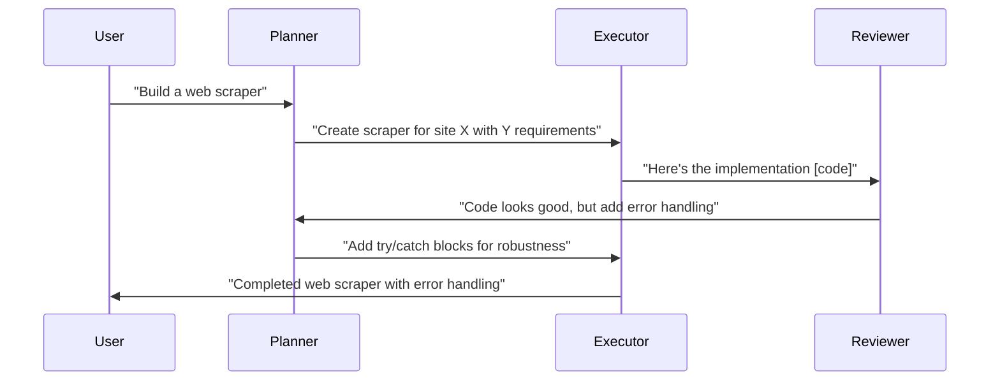
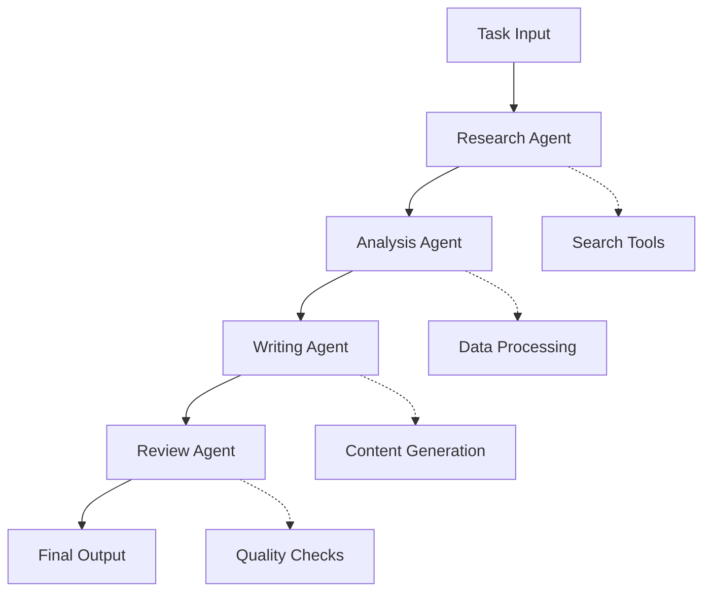
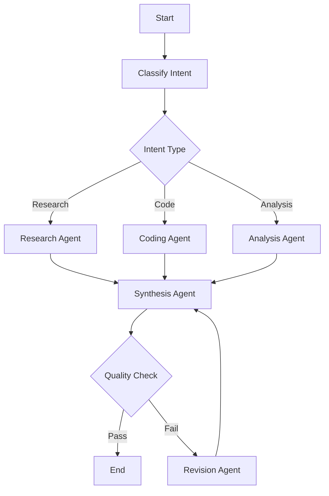
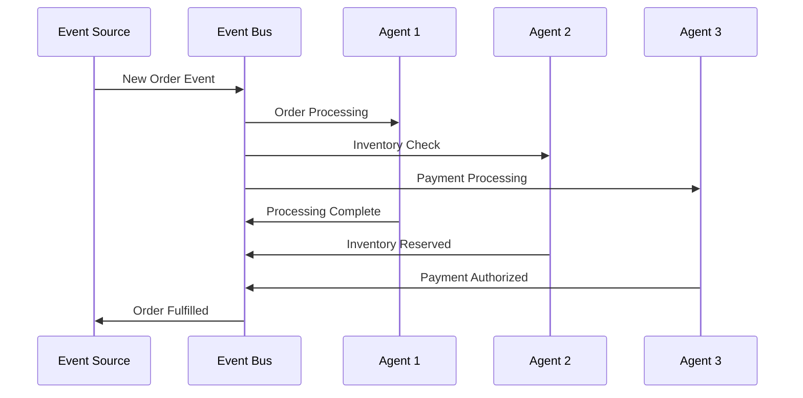
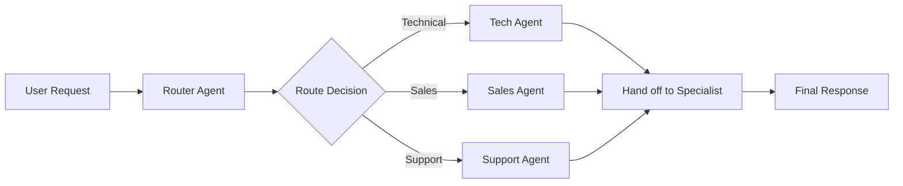

# 🤝 Multi-Agent Collaboration Patterns

Comprehensive guide to coordination patterns, communication protocols, and architectural approaches for multi-agent systems.

_Last reviewed: October 2025_

> **Note**: Performance metrics and framework versions are approximate, refreshed weekly via automation.

## 📊 Pattern Overview

| Pattern | Framework Example | Communication | Coordination | Use Cases |
|---------|-------------------|---------------|--------------|----------|
| **Conversation-Based** | AutoGen/AG2 | Message passing | Structured dialogue | Research, analysis |
| **Role-Based Teams** | CrewAI | Hierarchical handoffs | Role specialization | Business workflows |
| **Graph-Based Workflows** | LangGraph | State transitions | DAG execution | Complex pipelines |
| **Event-Driven** | Custom implementations | Pub/Sub, queues | Reactive triggers | Real-time systems |
| **Swarm Intelligence** | OpenAI Swarm | Lightweight handoffs | Dynamic routing | Task delegation |

---

## 🔁 Pattern Deep Dives

### 1. Conversation-Based Pattern (AutoGen/AG2)

**🎯 Core Concept**
Agents communicate through structured message exchanges, maintaining conversation history and context.

**💬 Communication Flow**


**🚀 Implementation Example**
```python
import autogen

# Define agents with specific roles
planner = autogen.AssistantAgent(
    name="planner",
    system_message="You break down complex tasks into actionable steps.",
    llm_config={"model": "gpt-4"}
)

executor = autogen.AssistantAgent(
    name="executor", 
    system_message="You implement solutions based on plans.",
    llm_config={"model": "gpt-4"}
)

reviewer = autogen.AssistantAgent(
    name="reviewer",
    system_message="You review implementations for quality and completeness.",
    llm_config={"model": "gpt-4"}
)

# Create group chat
groupchat = autogen.GroupChat(
    agents=[planner, executor, reviewer], 
    messages=[], 
    max_round=10
)

manager = autogen.GroupChatManager(
    groupchat=groupchat, 
    llm_config={"model": "gpt-4"}
)

# Start conversation
planner.initiate_chat(
    manager, 
    message="Build a Python web scraper for e-commerce prices"
)
```

**✅ Advantages**
- Natural communication flow
- Easy to debug and understand
- Flexible role assignments
- Rich conversation context

**⚠️ Challenges**
- Can become verbose (high token usage)
- Potential for circular conversations
- Requires careful prompt engineering
- Scaling beyond 3-5 agents becomes complex

---

### 2. Role-Based Teams Pattern (CrewAI)

**🎯 Core Concept**
Agents have specialized roles and responsibilities, with clear handoff points and hierarchical structure.

**💬 Communication Flow**


**🚀 Implementation Example**
```python
from crewai import Agent, Task, Crew
from crewai_tools import SerperDevTool, WebsiteSearchTool

# Define specialized agents
researcher = Agent(
    role='Senior Market Researcher',
    goal='Gather comprehensive market intelligence',
    backstory='Expert in market analysis with 10+ years experience',
    tools=[SerperDevTool(), WebsiteSearchTool()],
    verbose=True
)

analyst = Agent(
    role='Data Analyst',
    goal='Transform raw research into actionable insights',
    backstory='Specialist in statistical analysis and trend identification',
    verbose=True
)

writer = Agent(
    role='Technical Writer',
    goal='Create compelling reports from analysis',
    backstory='Experienced in translating complex data into clear narratives',
    verbose=True
)

# Define sequential tasks
research_task = Task(
    description='Research the AI agent market trends for 2025',
    agent=researcher,
    expected_output='Detailed market research with key findings'
)

analysis_task = Task(
    description='Analyze the research data for patterns and insights',
    agent=analyst,
    expected_output='Statistical analysis with trend predictions'
)

writing_task = Task(
    description='Write a comprehensive market report',
    agent=writer,
    expected_output='Professional report with executive summary'
)

# Create and execute crew
crew = Crew(
    agents=[researcher, analyst, writer],
    tasks=[research_task, analysis_task, writing_task],
    verbose=True,
    process='sequential'  # Can also be 'hierarchical'
)

result = crew.kickoff()
```

**✅ Advantages**
- Clear role separation and accountability
- Predictable workflow execution
- Easy to scale team size
- Good for business process automation

**⚠️ Challenges**
- Can be rigid for dynamic tasks
- Limited cross-role communication
- Handoff points can introduce delays
- May not handle exceptions well

---

### 3. Graph-Based Workflows Pattern (LangGraph)

**🎯 Core Concept**
Agents operate as nodes in a directed graph with conditional edges, enabling complex branching logic and state management.

**💬 Communication Flow**


**🚀 Implementation Example**
```python
from langgraph.graph import StateGraph, END
from langchain_openai import ChatOpenAI
from typing import TypedDict, Annotated
from operator import add

# Define shared state
class AgentState(TypedDict):
    messages: Annotated[list, add]
    intent: str
    output: str
    revision_count: int

# Define agent nodes
def classify_intent(state):
    llm = ChatOpenAI(model="gpt-4")
    message = state['messages'][-1]
    
    result = llm.invoke([
        {"role": "system", "content": "Classify the user intent as: research, code, or analysis"},
        {"role": "user", "content": message}
    ])
    
    return {"intent": result.content.lower()}

def research_agent(state):
    # Research implementation
    return {"output": "Research findings..."}

def coding_agent(state):
    # Coding implementation  
    return {"output": "Generated code..."}

def analysis_agent(state):
    # Analysis implementation
    return {"output": "Analysis results..."}

def quality_check(state):
    # Quality assessment logic
    quality_score = len(state['output']) > 100  # Simplified
    return quality_score

def revision_agent(state):
    # Revision logic
    return {
        "output": "Revised: " + state['output'],
        "revision_count": state.get('revision_count', 0) + 1
    }

# Build the workflow graph
workflow = StateGraph(AgentState)

# Add nodes
workflow.add_node("classify", classify_intent)
workflow.add_node("research", research_agent)
workflow.add_node("code", coding_agent)
workflow.add_node("analysis", analysis_agent)
workflow.add_node("quality", quality_check)
workflow.add_node("revise", revision_agent)

# Add edges
workflow.set_entry_point("classify")

# Conditional routing based on intent
def route_intent(state):
    intent = state['intent']
    if "research" in intent:
        return "research"
    elif "code" in intent:
        return "code"
    else:
        return "analysis"

workflow.add_conditional_edges("classify", route_intent)

# Quality check routing
def route_quality(state):
    if quality_check(state) and state.get('revision_count', 0) < 2:
        return END
    else:
        return "revise"

workflow.add_edge("research", "quality")
workflow.add_edge("code", "quality") 
workflow.add_edge("analysis", "quality")
workflow.add_conditional_edges("quality", route_quality)
workflow.add_edge("revise", "quality")

# Compile and execute
app = workflow.compile()
result = app.invoke({"messages": ["Analyze market trends for AI agents"]})
```

**✅ Advantages**
- Complex branching and conditional logic
- Stateful execution with memory
- Visual workflow representation
- Easy to modify and extend

**⚠️ Challenges**
- Higher complexity to set up
- Requires graph thinking/design
- Debugging can be challenging
- State management overhead

---

### 4. Event-Driven Pattern

**🎯 Core Concept**
Agents react to events and triggers, enabling real-time and asynchronous processing.

**💬 Communication Flow**


**🚀 Implementation Example**
```python
import asyncio
import time
from dataclasses import dataclass
from typing import Callable, Dict, List

@dataclass
class Event:
    type: str
    data: dict
    timestamp: float

class EventBus:
    def __init__(self):
        self.subscribers: Dict[str, List[Callable]] = {}
    
    def subscribe(self, event_type: str, handler: Callable):
        if event_type not in self.subscribers:
            self.subscribers[event_type] = []
        self.subscribers[event_type].append(handler)
    
    async def publish(self, event: Event):
        if event.type in self.subscribers:
            tasks = [
                handler(event) 
                for handler in self.subscribers[event.type]
            ]
            await asyncio.gather(*tasks)

class EventDrivenAgent:
    def __init__(self, name: str, event_bus: EventBus):
        self.name = name
        self.event_bus = event_bus
    
    async def handle_order(self, event: Event):
        print(f"{self.name} processing order: {event.data}")
        # Process the order
        await asyncio.sleep(1)  # Simulate processing
        
        # Emit completion event
        completion_event = Event(
            type="order_processed",
            data={"order_id": event.data["id"], "agent": self.name},
            timestamp=time.time()
        )
        await self.event_bus.publish(completion_event)

# Usage
async def main():
    bus = EventBus()
    
    # Create agents
    processor = EventDrivenAgent("OrderProcessor", bus)
    inventory = EventDrivenAgent("InventoryAgent", bus)
    payment = EventDrivenAgent("PaymentAgent", bus)
    
    # Subscribe to events
    bus.subscribe("new_order", processor.handle_order)
    bus.subscribe("new_order", inventory.handle_order)
    bus.subscribe("new_order", payment.handle_order)
    
    # Publish event
    order_event = Event(
        type="new_order",
        data={"id": "ORD-001", "amount": 99.99},
        timestamp=time.time()
    )
    
    await bus.publish(order_event)

# Run the example
# asyncio.run(main())
```

**✅ Advantages**
- Real-time responsiveness
- Loose coupling between agents
- Scalable and distributed
- Natural for reactive systems

**⚠️ Challenges**
- Event ordering complexities
- Error handling and recovery
- Debugging distributed events
- Potential for event storms

---

### 5. Swarm Intelligence Pattern (OpenAI Swarm)

**🎯 Core Concept**
Lightweight agents with simple handoff mechanisms, focusing on dynamic routing and task delegation.

**💬 Communication Flow**


**🚀 Implementation Example**
```python
from swarm import Swarm, Agent

def transfer_to_sales():
    return sales_agent

def transfer_to_support():
    return support_agent

# Define agents with handoff functions
router_agent = Agent(
    name="Router",
    instructions="Route customer queries to appropriate specialists.",
    functions=[transfer_to_sales, transfer_to_support]
)

sales_agent = Agent(
    name="Sales Specialist", 
    instructions="Help customers with product information and pricing."
)

support_agent = Agent(
    name="Support Specialist",
    instructions="Resolve technical issues and provide help."
)

# Initialize Swarm
client = Swarm()

# Run conversation with handoffs
response = client.run(
    agent=router_agent,
    messages=[{"role": "user", "content": "I need help with billing"}]
)

print(response.messages[-1]["content"])
```

**✅ Advantages**
- Simple and lightweight
- Dynamic agent switching
- Easy to understand and debug
- Good for routing scenarios

**⚠️ Challenges**
- Limited coordination patterns
- Basic state management
- Experimental framework status
- Less suitable for complex workflows

---

## 🛠️ Design Considerations

### 1. Communication Architecture

**Synchronous vs Asynchronous**
```python
# Synchronous (blocking)
result = agent1.process(data)
final_result = agent2.process(result)

# Asynchronous (non-blocking)
async def workflow():
    task1 = asyncio.create_task(agent1.process(data))
    task2 = asyncio.create_task(agent2.process(other_data))
    results = await asyncio.gather(task1, task2)
    return combine_results(results)
```

**Message Protocols**
- **Structured**: JSON, Protocol Buffers, Avro
- **Unstructured**: Natural language, free text
- **Hybrid**: Structured metadata + unstructured content

### 2. Memory Management

**Per-Agent Memory**
```python
class AgentWithMemory:
    def __init__(self):
        self.short_term_memory = []  # Recent interactions
        self.long_term_memory = {}   # Persistent knowledge
        self.working_memory = {}     # Current task context
    
    def remember(self, key: str, value: any, duration: str = "short"):
        if duration == "short":
            self.short_term_memory.append({key: value})
        else:
            self.long_term_memory[key] = value
```

**Shared Memory**
```python
class SharedKnowledgeBase:
    def __init__(self):
        self.facts = {}
        self.relationships = {}
        self.temporal_data = {}
    
    def update_fact(self, fact_id: str, value: any, agent_id: str):
        self.facts[fact_id] = {
            "value": value,
            "updated_by": agent_id,
            "timestamp": time.time()
        }
```

### 3. Tool Access & Permissions

**Capability-Based Access**
```python
class ToolRegistry:
    def __init__(self):
        self.tools = {}
        self.permissions = {}
    
    def grant_access(self, agent_id: str, tool_name: str, permissions: list):
        if agent_id not in self.permissions:
            self.permissions[agent_id] = {}
        self.permissions[agent_id][tool_name] = permissions
    
    def can_use_tool(self, agent_id: str, tool_name: str, action: str):
        agent_perms = self.permissions.get(agent_id, {})
        tool_perms = agent_perms.get(tool_name, [])
        return action in tool_perms
```

### 4. Failure Modes & Recovery

**Common Failure Patterns**
- **Deadlocks**: Circular dependencies
- **Infinite Loops**: Recursive handoffs
- **Resource Exhaustion**: Token/memory limits
- **Communication Failures**: Network/API issues

**Recovery Strategies**
```python
class FailsafePattern:
    def __init__(self, max_retries=3, timeout=30):
        self.max_retries = max_retries
        self.timeout = timeout
    
    async def execute_with_retry(self, func, *args, **kwargs):
        for attempt in range(self.max_retries):
            try:
                result = await asyncio.wait_for(
                    func(*args, **kwargs), 
                    timeout=self.timeout
                )
                return result
            except Exception as e:
                if attempt == self.max_retries - 1:
                    raise e
                await asyncio.sleep(2 ** attempt)  # Exponential backoff
```

---

## 📈 Performance & Scaling Considerations

### Token Usage Optimization
```python
# Efficient message compression
def compress_conversation(messages, max_tokens=4000):
    if estimate_tokens(messages) <= max_tokens:
        return messages
    
    # Keep system message and recent messages
    system_msg = messages[0]
    recent_msgs = messages[-10:]
    
    # Summarize middle messages
    middle_msgs = messages[1:-10]
    summary = summarize_messages(middle_msgs)
    
    return [system_msg, {"role": "system", "content": f"Previous context: {summary}"}] + recent_msgs
```

### Caching Strategies
```python
from functools import lru_cache
import hashlib

class AgentCache:
    def __init__(self, max_size=1000):
        self.cache = {}
        self.max_size = max_size
    
    def cache_key(self, prompt: str, model: str) -> str:
        return hashlib.md5(f"{prompt}:{model}".encode()).hexdigest()
    
    def get_cached_response(self, prompt: str, model: str):
        key = self.cache_key(prompt, model)
        return self.cache.get(key)
    
    def cache_response(self, prompt: str, model: str, response: str):
        key = self.cache_key(prompt, model)
        if len(self.cache) >= self.max_size:
            # Remove oldest entry
            oldest_key = next(iter(self.cache))
            del self.cache[oldest_key]
        self.cache[key] = response
```

---

## 🎆 Best Practices Summary

### ✅ Do's
- **Clear role definitions** with specific responsibilities
- **Explicit handoff criteria** and success conditions
- **Comprehensive error handling** and recovery mechanisms
- **Resource monitoring** (tokens, time, memory)
- **Conversation compression** for long interactions
- **Tool access controls** and permission boundaries
- **Testing at the pattern level** not just individual agents

### ⛔ Don'ts
- **Over-communicate** between agents (token waste)
- **Create circular dependencies** without termination conditions
- **Ignore failure modes** and edge cases
- **Mix patterns** without clear architectural boundaries
- **Skip monitoring** and observability setup
- **Hard-code agent relationships** (prefer dynamic routing)
- **Forget human oversight** for critical decisions

---

## 🔗 Next Steps & Resources

### Implementation Guides
- **[AutoGen Patterns](https://microsoft.github.io/autogen/docs/topics/conversation_patterns/)** - Official conversation patterns
- **[CrewAI Documentation](https://docs.crewai.com/)** - Role-based implementation guides
- **[LangGraph Tutorials](https://langchain-ai.github.io/langgraph/)** - Graph-based workflow examples

### Advanced Topics
- **[Enterprise Deployment](../guides/enterprise-deployment.md)** - Production considerations
- **[Agent Evaluation](../catalog/evaluation.md)** - Testing multi-agent systems
- **[Security Patterns](../guides/security-patterns.md)** - Multi-agent security considerations

---

